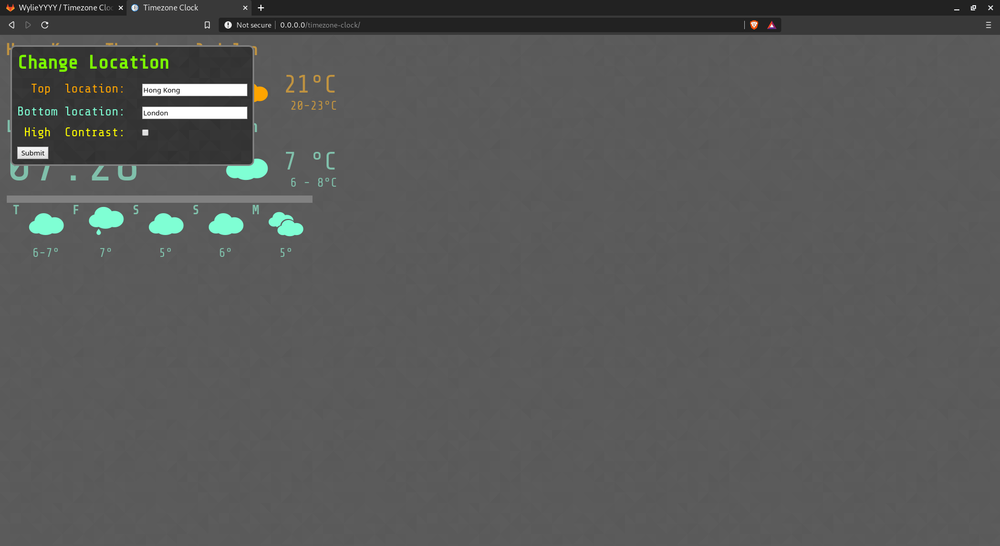

# Timezone Clock
Timezone Clock is a website setup for dual timezone clock with weather informations compatible 
with legacy browsers.
> **Please run setup.sh once with no appid before distributing to protect your appid**

#### Screenshots

### Features:
- Compatible with legacy browsers;
- Scaled UI with browser window's size;
- Flexible JSON request proxy for centralised request to API source;
- Can be used with a free subscription of OpenWeatherMap;

### Setup
The website can be hosted on a PHP server (detects .html and .php as PHP files) or used on client side (private use only as there is no appid protection), it is compatible and will auto detect how it is used.
However, there is no rate limit on client side, request limit imposed by OpenWeatherMap may be
exceeded and causes error, but as long as you limit the times you refresh or change location, client side will be fine.

Use *setup.sh* to setup. **For Bash, Apache and SQLite3 on Linux.**
> Modification will be needed for other shells, server hosting programs or operating systems.

Server should be pointing to the parent directory and index.html
Remove the following files before starting a public server:
- .git
- .gitignore
- README.md
- screenshot.png
- screenshot-menu.png
- setup.sh

#### Setup script summary
For for other shells, server hosting programs or operating systems, here is a summary of the setup script, variables are in square brackets:
1. Read in user's appid
2. If no appid is supplied, use `{{OPENWEATHERMAP_APPID}}` as user's appid
3. Replace all occurence of `target_key = "&units=metric&appid=[wildcard match anything]";` with `target_key = "&units=metric&appid={{OPENWEATHERMAP_APPID}}";` in `scripts/apiproxy.php`
4. Replace all occurence of `{{OPENWEATHERMAP_APPID}}` in `scripts/apiproxy.php` with user's appid
5. Remove `scripts/apijson.sqlite3`
6. Create SQLite3 database `scripts/apijson.sqlite3` with table named `Response`, with columns `Location TEXT PRIMARY KEY NOT NULL`, `Json TEXT NOT NULL` and `RequestTime INTEGER NOT NULL`
7. Change all files' permission to `664 (-rw-rw-r--)`, directories' permission to `775 (drwxrwxr-x)` (See [Wikipedia](https://en.wikipedia.org/wiki/File_system_permissions#Traditional_Unix_permissions) for notation explanation)
8. Change permission of `setup.sh` to `775 (-rwxrwxr-x)` for future execution
9. Detect the user group of web server (For Apache on Linux, it is `http` by default and found after `Group` keyword in `/etc/httpd/conf/httpd.conf`)
10. Change owner to `[self username]:[web server group]` for all items in the repository directory and parent directories up to the one before root (For example, `wylie` in default Linux Apache environment with repository of path `/home/repos/timezone-clock`; `repos`, `timezone-clock` and everything in `timezone-clock` will have the owner of `wylie:http`)
11. Change the permission of the repository directory and parent directories up to the one before root to `775 (drwxrwxr-x)`
